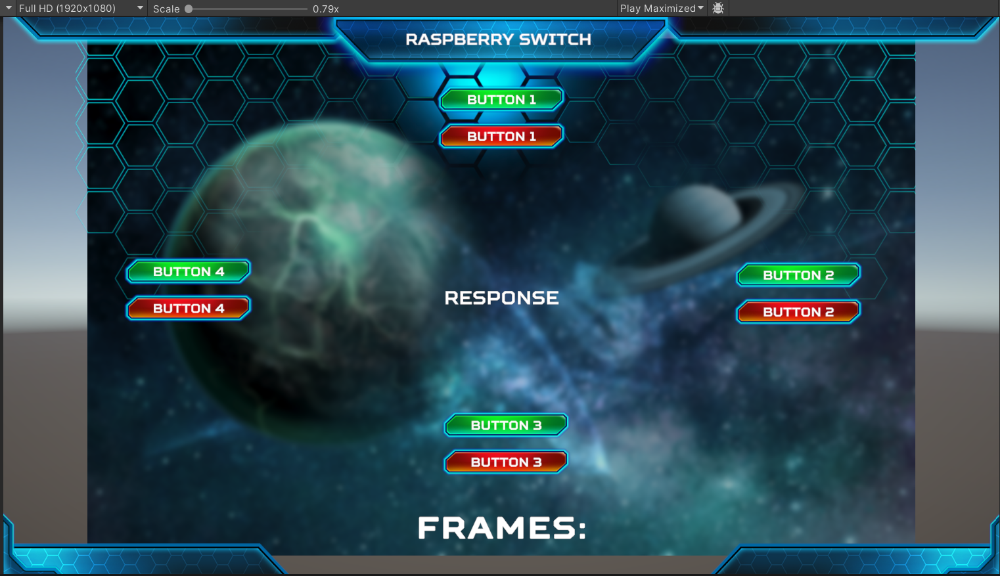

# Comunicación Serial con Unity

Este proyecto demuestra cómo establecer una comunicación serial entre Unity y un dispositivo externo, como un microcontrolador. En este caso, se utiliza un Arduino como ejemplo de dispositivo externo.

## Configuración del Puerto Serial

Para establecer la comunicación serial, es importante considerar dos propiedades clave:

1. **PortName**: Esta propiedad especifica el nombre del puerto serial al que se conectará el dispositivo. En Windows, los puertos seriales se identifican como `COM1`, `COM2`, etc. En Unix/Linux, se identifican como `/dev/ttyS0`, `/dev/ttyS1`, etc. Es esencial especificar el puerto correcto para establecer la comunicación con el dispositivo deseado.

2. **BaudRate**: Esta propiedad especifica la velocidad de transmisión de datos en bits por segundo (baudios). Es crucial que esta velocidad coincida con la configuración del dispositivo conectado. Si el dispositivo está configurado para comunicarse a una velocidad de 115200 baudios, como en este ejemplo, entonces la propiedad `BaudRate` debe establecerse en 115200 para que la comunicación sea exitosa.

## Relación con el Microcontrolador

Estas propiedades son fundamentales para establecer una comunicación correcta entre Unity y el microcontrolador. Si no se configuran correctamente, la comunicación puede no establecerse o puede ser inestable, lo que dificultaría la transmisión de datos entre ambos dispositivos.

Para más detalles sobre cómo se implementa la comunicación serial en Unity, consulte el código fuente en el archivo `Serial.cs`.
